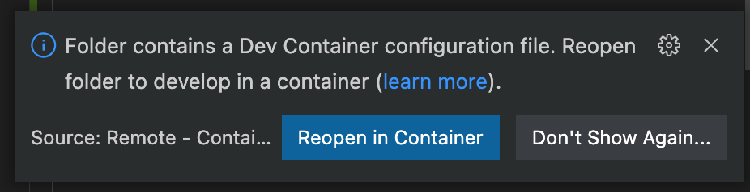

# Nodejs Api Server

[[_TOC_]]

Bienvenu au cours du Backend. Les objectifs de ce module sont :

* Introduction à NodeJS comme option de technologie backend
* Introduction à TypeScript
* La mise en place d'un environnement de développement stable avec Docker Dev containers
* Express JS : routes, contenu static, middleware, gestion d'erreurs, etc
* Tester votre API avec Postman
* Cas particuliers :
  * Implémenter un protocole d'identification
  * Téléchargement de fichiers
* Déploiement avec docker
  * Variables d'environnement


# Introduction à NodeJS

NodeJS est un choix intéressant pour un développement back-end pour plusieurs raisons :

* Le `Event-loop` du moteur node permet une grande réactivité et des opportunités de scalabilité horizontales
* Programmation asynchrone facile et nativement intégré avec `async` et `await`
* Utilisation de Javascript permet un partage de code front et back
* Un vaste dépôt de librairies tierces vis `npm`

Autres que ces raisons, je trouve personnellement que :
* le language de Javascript est extrêmement puissant, avec les possibilités de combiner parfois un paradigme _fonctionnelle_, parfois _orienté objet_, selon le cas les design-patterns les plus pertinents au problème à traiter.
* la couche `Typescript` permet de garantir un consistence dans le code, et ouvre les opportunités pour code-refactor, etc.
* La création d'un API avec le stack NodeJS/ExpressJS est simple, leger et _non-opinionated_. On peut suivre exactement ce qui se passe à tout moment, sans le lourdeur d'un framework plus élaboré.

Il y a bien sur des désavantages :
* NodeJS, bien sur, n'est pas aussi performant que d'autres languages en calcul pur. Il reste un language interprété qui souffre des mêmes problèmes des languages de ce genre. Mais, parfois le `event-loop` nous permet d'aller plus vite quand même.
* Il faut maîtriser les eccentricities du language Javascript, qui est extrêmement permissif (donc plus facile de faire des erreurs). `Typescript` nous permet d'améliorer la situation, mais pas totalement. Ensuite il y a l'évolution constant des versions de JS (ECMA), et la bataille de compatibilité à gérer. Mais on n'en est pas à l'abri dans d'autres languages.

[Quelques points sur NodeJS](https://nodejs.dev/learn/the-v8-javascript-engine) :

* Il est base sur le moteur **[V8](https://v8.dev)** qui est le moteur javascript du navigateur Chrome et maintenu par Google.
* Même si JavaScript est considéré un language interprété, en réalité le code est compilé par V8 avec un compilateur **just-in-time** (JIT) afin d'accélérer la performance.
* Il n'est pas multi-thread mais, grace à son `event-loop`, peut quand même exploiter des architectures **multi-processus**


# Installer NodeJS

On pourrait, bien sur, installer NodeJS en global sur notre ordinateur. Vous trouverez les installeurs [ici](https://nodejs.dev/download/).

> :warning: Le problème est que plus on a des projets différents, plus on aura besoin des versions différents de node.


# Environnement de développement : VSCode / Docker / NodeJS

Une solution serait d'utiliser un conteneur docker pour notre environnement de développement ! L'idée est de créer un environnement homogène à partager avec tout l'équipe, malgré le système d'exploitation.


L'idée est de créer une conteneur Docker qui aura déjà les éléments suivants :
* Une distribution de Linux (LinuxKit)
* Le moteur NodeJS fixe à une version précise

Si pas déjà fait, commencez par [installer Docker Desktop](https://www.docker.com/products/docker-desktop/)


Nous allons créer 3 fichiers :
* `Dockerfile.dev` : qui nous crée une image docker à utiliser (avec la bonne version de Node ainsi que les autre packages nécessaires)
* `docker-compose-dev.yml` : Contient le configuration pour lancer notre projet en tant que service Docker. On va commencer par créer un conteneur juste pour notre code, mais on pourrait par la suite ajouter d'autres services comme une base de données, Redis, etc.
* `.devcontainer/devcontainer.json` : qui explique à VSCode d'utiliser Docker pour notre environnement de dev. 

Créez un dossier de développement, dans lequel vous créez un fichier `Dockerfile.dev` :

#### **`Dockerfile.dev`**
```dockerfile
FROM node:18
WORKDIR /server
```

Ici on précise qu'on ve utiliser l'image NodeJS version 18, et on va preciser un chemin `/server` comme dossier de travail.

Ensuite nous allons rédiger notre `docker-compose.dev.yml` :

#### **`docker-compose.dev.yml`**
```yaml
version: '3.9'

services:
  vscode:
    build: 
      context: ./
      dockerfile: ./Dockerfile.dev
    command: /bin/bash -c "while sleep 1000; do :; done"
    container_name: api_vscode
    working_dir: /server
    networks:
      - app-network
    volumes:
      # Nous allons préciser le dossier local
      - .:/server:cached


networks:
  app-network:
    driver: bridge

```

Enfin, on crée le dossier `.devcontainer`, avec un fichier `devcontainer.json` dedans :

#### **`.devcontainer/devcontainer.json`**
```yaml
{
  "name": "NodeJS API Server",

  // Pointer vers notre docker-compose.dev.yml
  "dockerComposeFile": [
    "../docker-compose.dev.yml",
  ],

  // Le service dans docker-compose.dev.yml auquel on va attacher VSCode
  "service": "vscode",

  // Le dossier de travail précisé dans Dockerfile.dev
  "workspaceFolder": "/server",

  // Set *default* container specific settings.json values on container create.
  "settings": {},

  // Quelques extensions VSCode à inclure par défaut pour notre projet
  "extensions": [
    "pmneo.tsimporter",
    "stringham.move-ts",
    "rbbit.typescript-hero",
    "ms-vscode.vscode-typescript-tslint-plugin"
  ]
}
```

Nous fermons VSCode, et on le ré-ouvre précisant votre dossier de travail comme espace de travail. VSCode vous proposera de :

* Installer l'extension `Remote containers`
* Lancer votre projet dans un `Remote container`. Cliquez sur "Reopen in Container".



Sinon, en appuyant sur `F1`, et en tapant "Dev container", vous trouverez l'option d'ouvrir une dossier dans un conteneur.

Testez votre installation !

1. Ouvrez un nouveau terminal dans VSCode via le menu "Terminal".
2. Exécuter `npx cowsay "Hello World"`

```shell
root@d56db7be5711:/server# npx cowsay "Hello World"
 _____________
< Hello World >
 -------------
        \   ^__^
         \  (oo)\_______
            (__)\       )\/\
                ||----w |

```

Node fonctionne correctement ! :rocket: :rocket: :rocket:

# Mon premier projet NodeJS

Nous commençons des nouveaux projets node en initialisant le projet. Dans le terminal de VSCode :

```shell
npm init
```

Vous répondez à toutes les questions. A l'issue de cette instruction est le fichier crucial au projet : `package.json`

```json
{
  "name": "server",
  "version": "1.0.0",
  "description": "Mon premier serveur avec nodejs",
  "main": "index.js",
  "directories": {
    "doc": "docs"
  },
  "scripts": {
    "test": "echo \"Error: no test specified\" && exit 1"
  },
  "repository": {
    "type": "git",
    "url": "git@dev.glassworks.tech:hetic-mt1-p2023/backend/nodejs-api-server.git"
  },
  "author": "",
  "license": "ISC"
}

```

## `package.json` et `npm`

Le fichier `package.json` est l'indexe de votre projet. Il contient plusieurs informations utiles pour votre projet :
* Son nom, sa version etc.
* `scripts`: La liste de commandes possibles avec `npm run ...`. C'est ici où on va configurer comment notre code s'exécute, en mode dev ou prod.
* `dependencies`: Les librairies tierces venant des dépôts node à inclure dans notre projet. Ce sont la liste essentiel pour tourner notre projet en production.
* `devDependencies`: Les librairies supplémentaires pour compléter notre environnement de dev. Typiquement ce sont les librairies de test, ou des types à inclure (si on utilise TypeScript)

Les entrées `dependencies` et `devDependencies` sont automatiquement gérés par la commende `npm`. En effet `npm` est le __"node package manager"__ et on l'utilise pour installer, mettre à jour, ou enlever les librairies.

Par exemple, nous allons installer Express :

```shell
npm install express
```

On voit que `package.json` s'est mis à jour automatiquement :

```json 
{
  // ...
  "dependencies": {
    "express": "^4.18.0"
  }
}
```

On voit apparaître le dossier `node_modules` qui contient toutes les librairies tierces de notre projet.

D'autres commands de `npm` sont :

```shell
# Installer ou réinstaller tous les dépendances
npm install

# Enlever une librairie, ex. express
npm remove express

# Récupérer des l'information d'une librairie ex. express
npm view express

# Récupérer les versions d'une librairie
npm view express versions

# Installer une version précise
npm install express@4.9.5

# Lister les librairies plus à jour
npm outdated

# Mettre à jours les librairie installées
npm update

```

Les packages déployés par npm évolue en utilisant un système de versioning :

```
[version majeur].[version mineur].[version patch]
```

* **Patch** : sont les corrections de bug, et ne change pas le comportement ou compatibilité de la librairie
* **Version mineur** : Normalement retro-compatible dans la même version mineur, mais peut-être avec des refactoring ou des modifications (normalement ajouts) plus importants
* **Version majeur** : Risque de casser votre projet, il y aura des __breaking changes__, modifications qui risque de casser votre code, par exemple, c~hanger l'API, enlever les fonctions obsolètes, etc.

Dans `package.json` nous pouvons exprimer les limites de `npm update`, en utilisant les symboles suivants : 


[Source de l'image](https://bytearcher.com/goodies/semantic-versioning-cheatsheet/)

Dans `package.json` si on voit: 
* un tilde `~` devant la version : on va fixer la version mineur, mais autoriser les mises à jours de la version patch
* un caret `^` devant la version : on va fixer la version majeur, mais autoriser les mises à jours de la version mineur
* aucune symbole devant la version : on ne va jamais mettre à jour la version

On peut aussi préciser la version majeur, et laisser `npm` choisir la version mineur et patch automatiquement :

```
# Install la toute dernière version de express@3.*.*
npm install express^3.2

# Installer la toute dernière patch de express@4.18.*
npm install express~4.18
```

# Mon premier script

Nous allons créer une nouveau fichier `src/hello.js` :

#### **src/hello.js**
```js
console.log("Hello world");
```

Il est facile d'exécuter notre premier script avec la commande `node`:

```shell
root@d56db7be5711:/server# node src/hello.js 
Hello world !
```


> :thumbsup: Pour info, `console.log` va émettre vers le `stdout`, et `console.error` vers le `stderr`. Vous pouvez donc intégrer un script node dans votre chaîne de commandes. 

## Exécuter comme un script shell

On peut utiliser un `shebang` qui permet de rendre notre script exécuter comme n'importe quel script :

```js
#!/usr/bin/env node

console.log("Hello world !");
```

Et en rendant notre fichier exécutable, on pourrait l'invoquer comme un script shell:

```shell
# Rendre le fichier exécutable
root@d56db7be5711:/server# chmod +x src/hello.js 

# Lancer le script (à noter, sans "node" devant car le shebang précise l'interprète à utiliser!)
root@d56db7be5711:/server# ./src/hello.js 
Hello world !
```


## Exécuter avec npm

La version plus classique de lancer un script node est en utilisant `package.json`, notamment le tableau `scripts` :

#### **package.json**
```json
{
  // ...
  "scripts": {
    "hello": "node ./src/hello.js",
  },
}
```

On lance notre script avec :
```shell
npm run hello
```

Le champs `scripts` est très utile pour créer et configurer plusieurs façons de lancer notre code :
* Lancer le serveur en mode développement
* Lancer le serveur en mode production
* Lancer un script d'utilité qui, par exemple agit de façon ponctuelle sur votre base de données
* Lancer des tests
* Lancer des outils de validation de votre code (linter, orthographe, etc)

Par exemple, on aimerait que notre code se lance automatiquement dès qu'on apporte une modification. Pour cela, on va utiliser le package `nodemon` qui surveille notre base de code et relance le script dès qu'une modification est détectée :


```shell
# Attention, nodemon est utilisé exclusivement pour nous aider en développement, donc on l'inclut seulement dans les devDependencies en précisant --save-dev
npm install nodemon --save-dev
```

On modifie notre `package.json` afin d'utiliser `nodemon` au lieu de node :

#### **package.json**
```json
{
  // ...
  "scripts": {
    "hello": "nodemon ./src/hello.js",
  },
}
```

Relancez votre script :

```shell
npm run hello
```

Si on modifie `src/hello.js`, on vois que `nodemon` relance le script à chaque fois qu'on le sauvegarde. :fire: Pratique ! :fire:


A noter : Si nodemon ne relance pas votre script après une modification, il faut ajouter l'option `-L` pour activer le _legacy polling_.


# Next Steps

* [Le Event Loop de JS](./docs/javascript-et-son-event-loop/javascript-et-son-event-loop.md)
