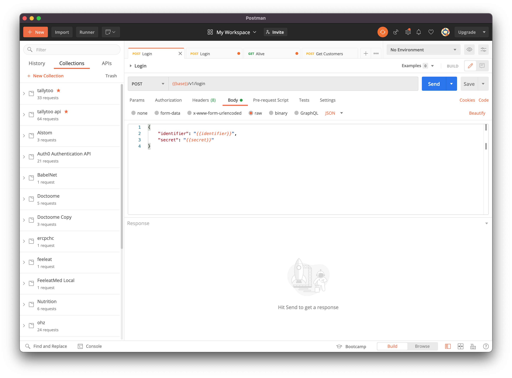

# Express

Express est une librairie simple mais puissant pour la création d'un serveur avec NodeJS.

Personnellement j'aime beaucoup pour les raisons suivants :
* Elle est **non-opinionated**, c'est à dire, je peut structurer comme je veux mes applications, sans avoir une structure imposé sur moi (comme Symfony etc). Ceci ouvre la possibilité d'erreurs, bien sur, mais offre plus de flexibilité aussi.
* Elle supporte toutes les fonctions d'un serveur :
  * Serve des fichiers statics
  * Répond à tous les requêtes HTTP
  * La gestion des forms
  * La gestion de multi-noeud cluster
  * La gestion de sockets
  * ...
* Elle est entièrement configurable :
  * On peut ajouter des `middleware` où on veut pour paramétrer entièrement nos end-points.
  * Facilement préciser le format des réponses


## Inclure express

```sh
npm install express

# Installer aussi les définitions des types pour express
npm install @types/express
```

Selon la librairies, on doit parfois installes les définitions Typescript de la libraire. La convention est le préfixe "@types/" avant le nom de la librairie.

De plus en plus de librairies incluent par défaut ses définitions dans la librairie de base, mais pas encore Express.


## Le serveur le au plus simple

Voici un exemple d'un serveur extrêmement basique :

```ts
import Express, { NextFunction, Request, Response } from "express";
import { join } from 'path';

// Récupérer le port des variables d'environnement ou préciser une valeur par défaut
const PORT = process.env.PORT || 5050;

// Créer l'objet Express
const app = Express();

// Créer un endpoint GET
app.get('/helo', 
  (request: Request, response: Response, next: NextFunction) => {
    response.send("<h1>Hello world!</h1>");
  }
);

// Server des fichiers statiques
app.use('/public', Express.static(join(__dirname, '..', '..', 'docs', 'media')));


// Lancer le serveur
app.listen(PORT,
  () => {
    console.info("API Listening on port " + PORT);
  }
);
```

J'ai crée une ligne dans `package.json` qui permet de lancer mon serveur avec `npm run server`.

En lançant le serveur, je peux donc ouvrir un navigateur aux liens suivants :
* [http://localhost:5050/helo](http://localhost:5050/helo)
* [http://localhost:5050/public/grunter.JPG](http://localhost:5050/public/grunter.JPG)


## Routing

On ajoute des "endpoints" ou "routes" en appelant la **methode** qui correspond à la requête HTTP souhaité :

```
const app = Express();

app.get('/helo', () => {});
app.post('/helo', () => {});
app.put('/helo', () => {});
app.delete('/helo', () => {});
// ... etc.

```

Le premier paramètre est le **chemin** (ou **path**) du endpoint relatif au nom d'hôte (selon votre configuration du serveur).

Le deuxième paramètre est une liste de **handler**, des fonctions qui seront appelées dans l'ordre quand la requête arrive.

Chaque **handler** peut prendre plusieurs paramètres :
0. (facultatif) `error`: le message d'erreur. Si le **handler** a 4 paramètres, il serait utilisé dans le cas d'erreur (voir en bas).
1. `request` : un objet qui représente la requête HTTP, qui donne accès aux en-têtes (**header**), les paramètres **query** (dans l'URL), les données du corps du message 
(**body**)
2. `response` : un objet qui représente la réponse qui sera renvoyé, ses en-têtes etc. Cet objet contient des fonctions qui permet de renvoyer une réponse immédiate, gérer son format, gérer le code HTTP de la réponse, etc.
3. `next`: un callback à utiliser si on créé un **middleware**, c'est à dire une fonction qui traite la requête mais qui ne va pas retourner une réponse. Il faut soit appeler `next()` pour signaler à Express de passer dans le prochain **handler**, soit `next(err)` pour signaler à Express qu'on a rencontrer une erreur.


Regardez [l'exemple d'un requête POST ici](../../src/express/demo-routing-1.ts).

Notamment :
* La possibilité d'enchaîner les **middleware**
* La possibilité d'utiliser les middleware `async`
* La pattern try/catch avec la fonction `next()` 
* L'utilisation des différentes valeurs dans `request`, comme `params`, `query`, etc.


## Tester les endpoints

Bien sur il est possible d'utiliser des outils comme `curl` pour tester votre endpoint :

```
curl -X POST localhost:5050/user/1234/update 
```

En générale, je préfère utiliser [Postman](https://www.postman.com/downloads/) : 



Cet outil permet de configurer et tester vos endpoints. 

> Exercice: téléchargez Postman et configurez un test pour le endpoint `/user/:userId/update`. 
> Observez les headers
> Essayez d'envoyer des paramètres **query** (dans l'url, après le `?`)
> Essayez d'envoyer du json dans le **body**
> Essayer à ne pas passer un paramètre `:userId`

# Exercice

Créer un nouveau projet "from-scratch", en essayant de tester vos compétences en dev-containers, nodejs, typescript, expressjs, etc.

Il faut créer un serveur calculatrice avec les endpoints suivants :

```
# Calculez la factorielle de 8
GET /calc/factorial?val=8  

# Accepter une body avec 2 valeurs : p et n, pour calculer la combinaison (https://www.123calculus.com/combinaison-page-1-16-140.html)
POST /calc/combinaison

# Calculer l'hypotenuse en utilisant pythagore, en passant le x et y uniquement pas les headers... est-ce possible ?
DELETE /calc/hypot 


```


## Middleware 

On peut faire un peut de refactoring dans notre code, et extraire des **middleware** qui seront utilisés à plusieurs endroits.

En générale, on peut injecteur un middleware sur la racine ou sur une sous-chemin, dans l'ordre de sa définition :

```ts

// L'appli parse de façon global le corps du message entrant comme du json
app.use(json());

// Ce middleware sera utilisé de façon globale
app.use(
  async (req: Request, res: Response, next: NextFunction) => {

    next();
  }
);


// Ce middleware n'est utilisé sur qu'un seul chemin et tout ses enfants
// Par exemple, on put protéger un sous-branche d'endpoints avec un middleware qui valide 
// d'abord l'identité et autorisation de l'utilisateur
app.use(
  '/auth',
  async (req: Request, res: Response, next: NextFunction) => {

    next();
  }
); 
```

A noter, dans l'exemple, `body-parser` est un middleware externe à installer avec `npm install body-parser`, qui va toujours parser le corps des messages entrants en format json.

Il est possible de créer aussi des `Router`, un objet qui regroupe un set de routes, qu'on peut attacher comme middleware à l'arborescence :

```ts

// Définir un router qui représente une sous-branche de notre hiérarchie :
const router = Router({ mergeParams: true });

router.get('/',
  async (request: Request, response: Response, next: NextFunction) => {
    /// ...
  }
);

router.post('/:userId',
  async (request: Request, response: Response, next: NextFunction) => {
    /// ...
  }
);

/// ....

/// Ensuite, on peut attacher la sous-branche où on veut, ici sous /user
app.use('/user', router);

/* Les endpoints suivants vont désormais être disponibles :
GET /user
POST /user/:userId
*/
```

Dans l'exemple on attache un router qui commence à gérer les opérations CRUD au chemin `/user`. On commence à voir qu'il serait possible (avec un peu d'intelligence) de créer un set générique de **handler** pour gérer les opérations CRUD, et les attacher aux différents points dans la hiérarchie.


[Regardez l'exemple factorisé ici](../../src/express/demo-routing-2.ts).

A noter :
* On peut utiliser le mot clé `export` d'un fichier typescript afin de le rendre accessible de l’extérieur du fichier, et l'inclure dans un autre fichier.
* Dans [authorize-user.middleware.ts](../../src/express/middleware/authorize-user.middleware.ts) je vous présente un pattern de la programmation fonctionnelle qui permet de passer des paramètres avant de retourner une fonction personnalisé. Ceci permet de réutiliser des middleware ou handlers

# Next Steps

[MySQL](../mysql/mysql.md)