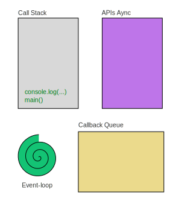
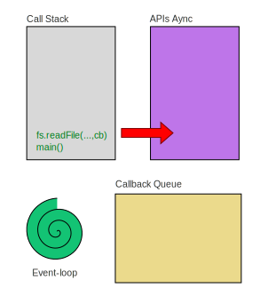
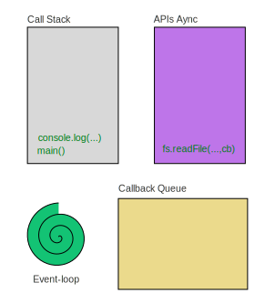
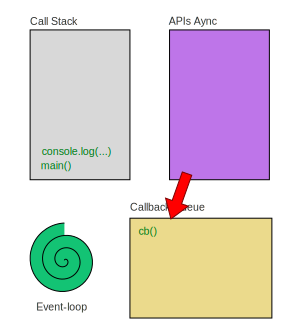
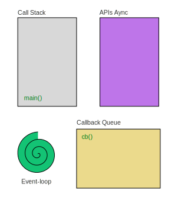
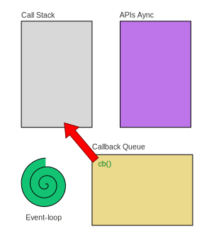

# Javascript et son event loop

Une des features les plus importants de NodeJs le sa façon de gérer les instructions asynchrones via son `event loop`. On à la possibilité d'écrire du code qui gère une multitude d'actions en parallèle, sans toute la complexité autour du paralèllisme.

Considérer le code suivant :


```js
const fs = require("fs");
const path = require("path");

const FICHIER = path.join(__dirname, '..', '..', 'docs', 'media', 'grunter.JPG');

// Chargement synchrone
console.time("Load file");
fs.readFileSync(FICHIER);
console.timeEnd("Load file");


// Chargement asynchrone en utilisant le event-loop
console.time("Load file async");
fs.readFile(FICHIER, 
  // 2ème paramètre le "callback", la fonction à appeler quand le fichier est prêt
  // Ici, on utilise une fonction "flèche" (arrow function)
  (err) => {
    if (err) {
      console.err(err.message);
      return;
    }

    // Faire quelques choses avec le fichier
    console.log("File loaded!");
  }
);
console.timeEnd("Load file async");

console.log("Starting up loader...");
```

Ce code charge un fichier de taille grande. Imaginons qu'on utilisait ce code dans une requête serveur.

Si on utilise une fonction `readFileSync` on bloque **tout le processus node** pendant le chargement du fichier. C'est très embêtant si on a beaucoup de requêtes en parallèle - toutes les autres requêtes doivent attendre avant d'être traités, et si la connexion subit un timeout, tant-pis !

Javascript permet de lancer le chargement, et continuer à traiter d'autres instructions entre-temps, grâce au système **event loop** : 

Par défaut, empile les fonctions dans ce qu'on appelle le "Call Stack". Le script d'origine (ou d'entrée) est appelé `main`, qui est ajouté au stack par défaut :


Toutes les instructions synchrones sont "push" sur le stack et traitées une par une...



Dès qu'on rencontre une instruction asynchrone, le moteur JS, la retire du Call Stack et planifie don éxécution sans les API's correspondants.



Cette fonction peut donc être exécuté dans un `thread pool`, et sur un processeur indépendant (selon l'architecture de votre machine). Entre-temps, on continue dans notre script, en ajoutant l'instruction suivante au Call Stack :



Imaginons que pendant l'exécution de cette instruction, le chargement de notre fichier s'abouti. Le `callback` qui a été envoyé comme paramètre à la fonction et ajouté au Callback Queue : un fil d'attente des callbacks à exécuter dès que le Call Stack devient vide.



Le `Event Loop` est une simple boucle dans le genre (en pseudo-code) :

```
while true {
  if size(call_stack) == 0 and size(callback_queue) > 0
    call_stack.push(callback_queue.removeAt(0))
  fi
  sleep 
}
```

L'idée est que la boucle tourne à l'infinie. Dès qu'il n'y a plus rien dans le Call Stack, on va chercher le premier élément du Callback Queue, et l'ajouter au Call Stack.

Il faut donc attendre que le Call Stack soit vide. On laisse terminer la dernière instruction :



Ensuite, on arrive à la fin du script principal, on enlève `main()`. Le event loop ajoute donc le callback au Call Stack :




Ensuite on exécute ce callback comme un fonction normal :


Quand le CallStack est vide ainsi que le Callback Queue, c'est la fin de notre script.

# Avantages

Il y a plusieurs avantages à cet approche :

* La gestion des APIs Async se fait par le `thread pool`, qui gère la complexité de programmation parallèle pour nous. Les moteurs comme v8 vont essayer d'optimiser les nombre de threads en parallèles selon le nombre de cores disponibles sur notre machine.
* Une opération longue (chargement de fichier, par ex.) ne va pas bloquer d'autres activités.
* Pour une appli de type serveur, cela veut dire qu'on peut accepter un grand nombre de requêtes en parallèle (sans le rejeter pour manque de ressources)

# Next Steps

* [Typescript](../typescript/typescript.md)
